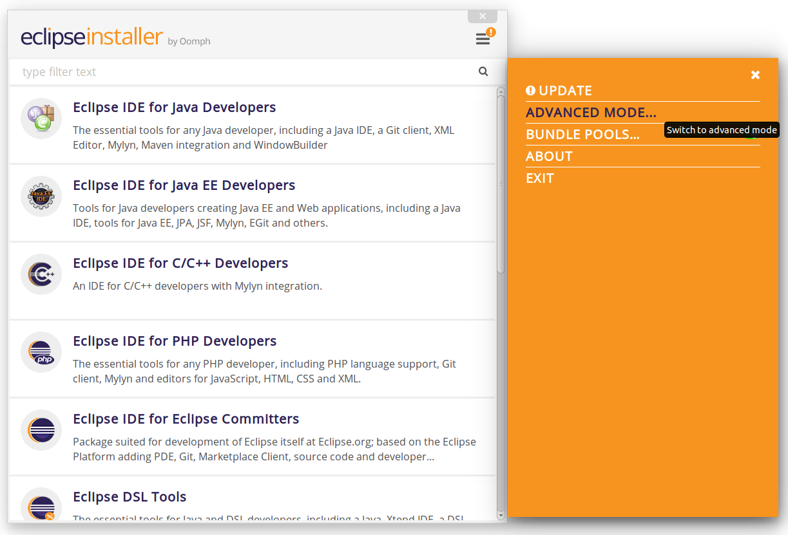

# SysML v2 Pilot Implementation Protoyping

## Installation Instructions

### Development Environment

#### Install using oomph

The project provides a configuration file for the [Eclipse Installer](https://wiki.eclipse.org/Eclipse_Installer) which eases the creation of reproducible development environments. 

1. Download the Eclipse Installer from https://www.eclipse.org/downloads/packages/installer.

2. Clone our GitHub repository from the URL below.
   * https://github.com/ModelDriven/SySML-v2-Pilot-Implementation.git
   
3. Open Eclipse Installer and switch to Advanced mode:


4. In the product list, select "Eclipse Modeling Tools" with Product Version: 2019-06.

5. In the Projects window, to the left of the text box, click the "+" to the add the Sysml2 project as user project. In the dialog, choose Category: Github Projects and browse the file system to select the setup file from the local git repository.
   * e.g. `file:/C:/git/sysml/SysML-v2-Pilot-Implementation/org.omg.sysml.installer/SysML2.setup`
   **Note:** If you have installed the SysML v2 Pilot Implementation previously, this may already be pre-selected.

6. Select SysML2 in the Projects list:


7. On the next page, update the following variables, then press Next.
   * Git clone location rule: Select "Located in specific absolute folder location" and browse to the directory for the SysML git repository.
   * Root install folder: Change this if you wish the installation to be under a specific folder.
   * Workspace location rule: Change this if you wish to place the workspace at a specific location.
   
8. On the Confirmation page, press Finish. 

#### Manual installation

1. Install Eclipse 2019-06 (4.12) and Xtext.
   * If you are installing Eclipse fresh, the easiest approach is to just install the “Eclipse IDE for Java and DSL Development” package, which includes Xtext.
      * https://www.eclipse.org/downloads/packages/release/2019-06/r/eclipse-ide-java-and-dsl-developers
      
   * Alternatively, you can install the “Eclipse Modeling Tools” package (which includes other modeling capabilities, like UML, that you don’t need now but will likely be useful in the future), and install Xtext into that (per below).
      * https://www.eclipse.org/downloads/packages/release/2019-06/r/eclipse-modeling-tools
      
   * To install Xtext into an existing Eclipse 4.12 instance, select Help > Install New Software, use the update site URLgiven below, and install “Xtext Complete SDK” (under General Purpose Tools).
      * http://download.eclipse.org/releases/2019-06

2. Clone our GitHub repository from the URL below.
   * https://github.com/ModelDriven/SySML-v2-Pilot-Implementation.git

3. Import all projects from the repository into your Eclipse workspace. This should include the projects `org.omg.sysml` and `org.sysml.owl`, with associated `ide`, `tests`, `ui` and `ui.tests` projects for each.

### Prototype Alf Implementation

1. Find the file `org.omg.sysml/src/org.omg.sysml/GenerateAlf.mwe2`, right click on it, and select Run As > MWE2 Workflow, to execute the Xtext generator.

2. Once the generation is complete, right click on project `org.omg.sysml`, and select Run As > Eclipse Application. This should launch a new runtime Eclipse instance.

3. Add the SysML-v2-Pilot-Implementation Git repository (already cloned previously) to the runtime Eclipse instance.

4. Import the project `sysml` into the runtime Eclipse workspace.

5. Double clicking on any `.alf` file in the sysml project should open it in the generated Xtext Alf editor.
 
## Copyright License Header

#### For new code
Set up a Java code template as follows:
1. Window > Preferences (Mac-OS: Eclipse > Preferences)
2. Java > Code Style > Code Templates
3. Code > New Java files > Edit
4. **Prepend** (insert above the existing content) the following and modify the second line:
    ```
    /**
     * SysML 2 Pilot Implementation
     * Copyright (C) 2019  California Institute of Technology ("Caltech")
     *
     * This program is free software: you can redistribute it and/or modify
     * it under the terms of the GNU Lesser General Public License as published by
     * the Free Software Foundation, either version 3 of the License, or
     * (at your option) any later version.
     *
     * This program is distributed in the hope that it will be useful,
     * but WITHOUT ANY WARRANTY; without even the implied warranty of
     * MERCHANTABILITY or FITNESS FOR A PARTICULAR PURPOSE.  See the
     * GNU Lesser General Public License for more details.
     *
     * You should have received a copy of the GNU Lesser General Public License
     * along with this program.  If not, see <https://www.gnu.org/licenses/>.
     *
     * @license LGPL-3.0-or-later <http://spdx.org/licenses/LGPL-3.0-or-later>
     */
    ```
5. Apply > OK

#### For existing code
* When modifying existing code created by someone in a different organization, add a new copyright line, without changing anything else in the header.
* When modifying existing code for the first time in a new year, add the year as the latest year in the appropriate copy right line. (E.g., in 2019, "Copyright (C) 2018" becomes "Copyright (C) 2018-2019" and in 2020 it becomes "Copyright (C) 2018-2020".)

#### Sources
* [GNU GPL v3.0 - How to Apply These Terms to Your New Programs](https://www.gnu.org/licenses/gpl-3.0.en.html)
* [Using the SPDX License List for Tagging and Linking](https://hakre.wordpress.com/2012/07/25/using-the-spdx-license-list-for-tagging-and-linking/)
